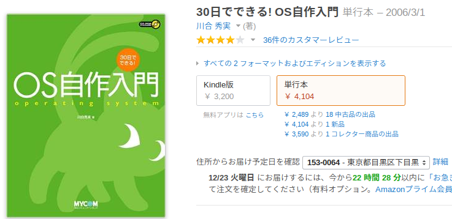
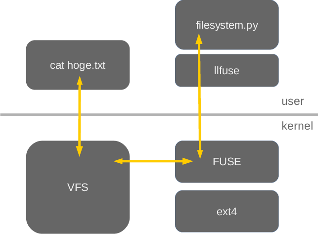
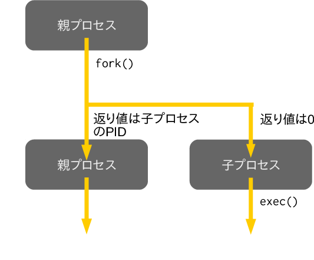

class: center, middle

# Pythonによるファイルシステムとシェルの作成実験

---
## 目次

1. **当初の方向性**
1. 製作物その1 ファイルシステム
1. 製作物その2 シェル
1. 1年を通じて

---
## 当初の方向性

* OSについて手を動かしながら学ぶ

---
## 30日でできる! OS自作入門

---
## 目次

1. 当初の方向性
1. **製作物その1 ファイルシステム**
1. 製作物その2 シェル
1. 1年を通じて

---
## 製作物その1 ファイルシステム

* Python

* FUSE

* llfuse

---
## FUSEとは

* Filesystem in USErspace

* 普段通りのプログラムを書くだけでファイルシステムになる

---
## イメージ

---
## イメージ

---

## メソッドの一例

* def open(self, inode, flags):
* def create(self, inode_p, name, mode, flags, ctx):
* def getattr(self, inode):
* def read(self, fh, off, size):
* def write(self, fh, offset, buf):
* def lookup(self, inode_p, name):

---
## 完成したファイルシステムの概要

* 単一のファイルで管理
* ファイルの作成や削除、読み書き
* ディレクトリも作れる
* シンボリックリンクも作れる

---
## ファイルシステムのデモ

---
## 目次

1. 当初の方向性
1. 製作物その1 ファイルシステム
1. **製作物その2 シェル**
1. 1年を通じて

---
## シェルはOSの機能じゃない💢

* 元はPythonでスケジューラを目指してた

--

* 単一のプログラムを実行

--

* もしかして: シェル

---
## 製作物その2 シェル

* またPython

---
## どうやって実行するか

* fork・exec

---
## 完成したシェルの概要

* コマンドが実行できる
* パイプ、リダイレクトもちゃんと動く
* バックグラウンド実行もできる
* 論理演算子をサポート
* 変数とループがない(条件分岐はできる)

---
## シェルのデモ

---
## 1年を通じての成果

* ファイルシステム
  * ファイル、ディレクトリの読み書き
  * 永続化

* シェル
  * コマンドの実行
  * リダイレクト、パイプ
  * 論理演算

---
## 考察・感想

* 手を動かすことはできた

* 知識でわかっていても、実際に作って動くと楽しい

* もっと具体的にテーマを決めるべきだった
